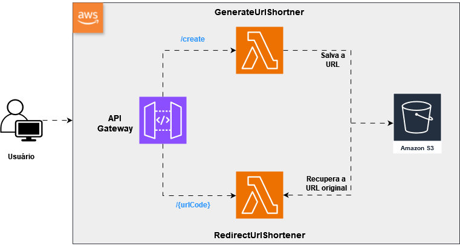

# URL Shortener System with AWS

This project implements a simple and functional system to shorten URLs using AWS infrastructure. It allows you to
generate short links that redirect to original URLs, as well as set expiration times. Everything is managed in a
serverless environment.

**Note**: This project is part of a series. Here’s the link
to [project 2](https://github.com/LeonardoSardagna/URLShortenerCreator)

## Features

The system consists of two Lambda functions:

### 1. URL Generation

Responsible for creating short links and saving them in Amazon S3, storing:

- The original URL
- The expiration time
- A unique identifier (UUID)

### 2. Redirection

Validates the short URL code, checks the expiration time, and redirects the user to the original URL.

## Prerequisites

## Technologies Used

- **AWS Lambda**: To execute the URL generation and redirection functions.
- **Amazon S3**: To store the data in JSON format.
- **API Gateway**: To expose HTTP endpoints.

## Configuration

### 1. Create Lambda Functions

- **GenerateUrlShortener**: Implements the logic for creating and storing URLs.

- **RedirectUrlShortenerLambda**: Manages the redirection with code validation.

### 2. Configure Permissions

- Allow Lambda functions to read and write to the S3 bucket.

### 3. Configure the API Gateway

- **POST Route**: `/create` connected to the `GenerateUrlShortener` function.
- **GET Route**: `/{urlCode}` connected to the `RedirectUrlShortenerLambda` function.
- After setting up the API Gateway, we can remove direct access to the Lambda functions, ensuring all requests go
  through the API Gateway.

## Application Diagram

